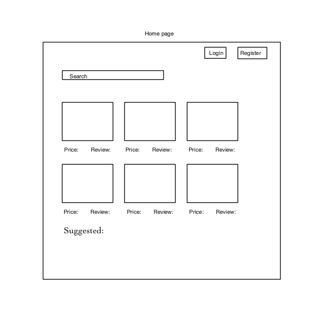
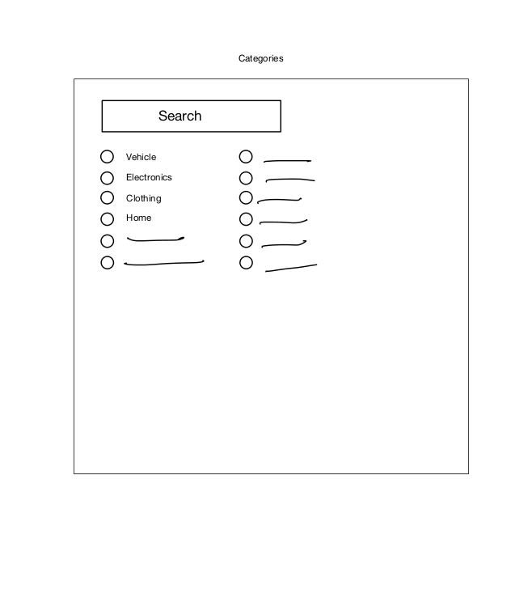
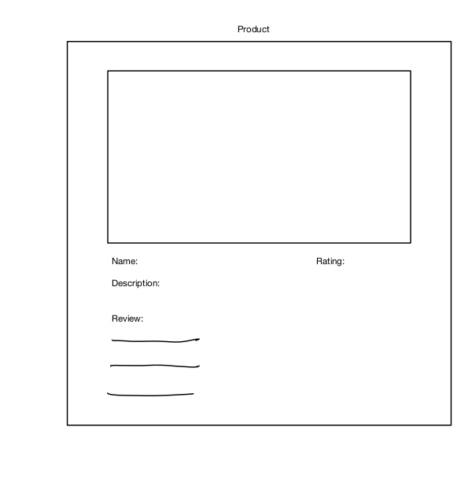

# Price Scrapper
CPSC 455 Project: Team merge-conflict

**Price Scrapper provides a centralized experience by allowing everyday consumers to browse amongst the most popular e-commerce vendors in finding the best/lowest price for items they wish to purchase without navigating through various vendors.**

## Project description
Price Scrapper aims to assist everyday consumers in finding the best/lowest price for items they wish to purchase. Consumers have an option of accessing the website as a guest or a user. The difference between the two is that users get the option of viewing their recently visited items and keep track of items they want to purchase later in a wish list. Consumers have an option to search through various vendors such as viewing items on all vendors, only viewing items on Amazon or only on Ebay. They also have the option to sort through their search results to either view items with high/low price or high/low rating first.

Note: Website designed for larger screens (preferably 1920px x 1080px and above)

## Project task requirements

|          | Tasks                                                                                                                   | Completed?             |
|----------|------------------------------------------------------------------------------------------------------------------------|-------------------------|
| **Minimum**  | Product Querying (searching for clothing, cars, electronics, etc)                                                  | :heavy_check_mark:      |
|          | Display item and associated information                                                                                | :heavy_check_mark:      |
|          | Web Scraping/using API's for specific sellers to gather information on queried items                                   | :heavy_check_mark:      |
| **Standard** | Product Ordering (High to Low, Low to High, Most Reviews, etc)                                                     | :heavy_check_mark:      |
|          | Product Statistics (Mean price, Standard Deviation, Mean, etc)                                                         | :heavy_check_mark:      |
|          | Login and registration of a personal account                                                                           | :heavy_check_mark:      |
|          | Recently viewed                                                                                                        | :heavy_check_mark:      |
| **Stretch**  | Having a review system for products through account. (Star and comments)                                           | :heavy_check_mark:      |
|          | Having a communication centre between buyer and seller (Chat system)                                                   | :x:                     |

## Unit 1-5 Learning Goals:
### Unit 1: HTML, CSS, JS
Our frontend components are either from React Bootstrap or Material-UI. However, they are heavily customized to fit our needs with HTML and CSS. These components are integrated into our app with JSX which is the syntax extenstion of JavaScript in React.

### Unit 2: React & Redux
Most of our frontend components are resuable React components such as Product Card, Product Table and Suggested Item carousel. We used Redux to pass around the authentication token associated with the user in order to authenticate them and to pass around items that need to be showcased.

### Unit 3: Mongo DB
Our database is hosted on MongoDB which contains all our user information such as their first and last name, email, recently viewed list and wish list.
Since MongoDB is a NoSQL database, it allows us to easily customize schemas using Mongoose to store various information for each user and item.

### Unit 4: Node & Express
Node and Express was used to implement our endpoints that was queried through our frontend. We used Express Router to seperate our endpoints into categories such as vendor API calls or getting user information.

### Unit 5: Release Engineering
Price Scrapper is deployed and hosted on Microsoft Azure. Our team also used Github Actions to automate the deployment process.

## Above and Beyond Functionalities
### Custom links for items
Initially, we did not have custom links for each item due to technical difficulties. The item received from vendors already had a link of their own associated with the vendor, so it was difficult to have custom links for each item. However, we decided to work through those issues to create custom links so users can easily share them to their friends or family.

### Wish list and popular searches
Adding a wish list and popular searches was not part of our plan, but we decided to add these features since they enhance the overall experience for users. The wish list allow users to keep track of items they want to purchase in the future and popular searches allow users to stay with the current trend and purchase the hottest items on the market.

### Deployment with Azure
We chose to deploy Price Scrapper on Azure instead of Heroku which most teams decided to deploy onto because Azure has a better CI/CD pipeline and gives users more flexibility when creating that pipeline. Moreover, it is more secure and credible than Heroku.

## Next steps
We have completed all our standard requirements and one of our stretch goals. Next steps would be completing the remaining stretch goal which would be add a way of communication between buyer and seller. Moreover, we also plan on adding notifications to users who have signed up about a price drop to items on their wish list and allowing users to view all their posted reviews in their profile page with an option to delete them. Lastly, the UI could be improved with more responsiveness.

## List of Contributions

### Amy Yung (g8y9a): 
Mostly worked on implementing frontend components such as search bar, suggested item carousel, side menu and navigation bar, designed layout and added responsiveness where possible, connected backend API calls to frontend components for a user's profile page, did initial setup with basic components and layout and assisted other team members.

### Alireza Ghiam (j6i2b): 
Designed inital layout of all pages and helped setup redux, mostly worked on the product details page with adding reviews, ratings, average price and other information fromt the vendor APIs and assisted other team members.

### Amir Sayyar (e7h2b): 
Did inital setup with React App and MongoDB, deployed project onto Azure, mostly worked on backend with authentication, setting up API calls to vendors and MongoDB, added pagination and loading spinner for search results and assisted other team members.

### Satyak Handa (y6i2b): 
Researched and added suitable vendors to scrape information from, connected vendor APIs to search results table, added a vendor filter, made suggested items carousel to dynamically load items and assisted other team members.

## Brief sketch of our initial layout

### Page One

### Page two 

### Page three

